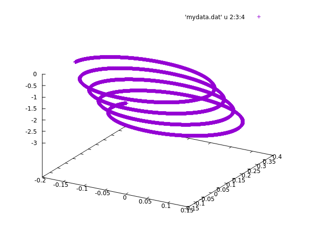

# `livecode-chargedParticle`
---


A simple implementation of an Euler integrator for projectile motion. This program was written (mostly) live, in lecture for SOFE-2850U in Fall 2017.

An implementation of the Verlet Integrator to plot the motion of a charged particle in an electric field.

## Compilation

Compile with
```bash
clang++ -std=c++14 -o projectile projectile.cpp
```
or
```bash
g++ -std=c++14 -o projectile projectile.cpp
```
and run as
```bash
./projectile
```
and watch your terminal fill with numbers.

## Graphing with GGNUPlot
run as 
```bash
./projectile > mydata.dat

gnuplot

splot 'mydata.dat' u 2:3:4'
```
So we only print out columns 3 to 5, giving only the positions!
## Output

The output will be six columns of numbers with the following order:
```
time [s], x-position [m], y-position [m], z-position[m], x-speed [m/s], y-speed [m/s], z-speed[m/s]
```
Example output:   


### Questions:

## 2:
The Euler integration calculates the velocity of the particle at time t + dt by using the acceleration at time t.  This does not account for the fact that the acceleration is also changing based on the position of the particle!  The Verlet integration method derives a more accurate velocity by averaging the acceleration before and after the position change, and also derives the position at time t + dt using the acceleration at time t.  It does so by implementing some dynamic equations. 

Overall, the Verlet integration takes into account the changing acceleration for the velocity, as well as the particle’s acceleration for the position, two things that Euler’s method did not do.

How does this affect the plotted positions?

As the particle follows a near-circular path (in the x and y directions), the acceleration is constantly changing.  Because the euler algorithm is less accurate at modelling the velocity and position based on changes in acceleration, we can expect that it will have a larger overall radii.  This is verified by plotting the x and y coordinates in against each other for each method and comparing them:


Furthermore, as the electric field does not affect motion in the z direction, both methods have the same z position at any given time.

What it means:

Without much math, it can be seen that the smaller the step size, the lower the difference in the results.  For this particular application, the Euler algorithm yields close results to the Verlet algorithm, both because the step size is sufficiently small and because the motion is near-periodic in either the x or y direction.  For more complicated (non-circular) paths with the greater (higher degree) acceleration acceleration changes, the Euler algorithm would be less accurate.

## 3: 
A vector constitutes a vector is closed under addition and scalar multiplication. In our case VecR2 is an integer type which does not constitute a vector space because it is closed under addition but not under scalar multiplication. 
For the two vectors be closed under addition, its sum must be inside of the Vector space.
Let u, v and z be integer type vectors in a 2D Vector Space (VecR2)
Let x, y be the components of vector u and are integer type.
Let x, y be the components of vector v and are integer type.
To add two vectors we must add its components together. 
z = u + v  
u + v = (x, y) + (x, y) ∈ VecR2
u + v = (x+x, y+y)  ∈ VecR2
z = (2x + 2y) ∈ VecR2
Since u and v are vectors in VecR2 type the sum of u and v (vector z) must also be vector inside of VecR2. The sum of u and v (a+c, b+d) is an integer type since all of its components are integers. Hence it is closed under addition. 

Let u be a vector inside a 2D Vector Space (VecR2).
Let x, y be the components of vector u and are integer type.
Let c be a scalar of any type. 
c*u = c * (x, y) ∉ VecR2
c*u = (c * x, c * y) ∉ VecR2
The result of an integer and a double results in an integer but the result will truncate (lower value). Since the result of scalar multiplication is an integer with a lower value it can be concluded that u is not closed under scalar multiplication. 
Since the second axiom failes the VecR2<int> is not a vector!

TLDR: Because it is not closed under scalar multiplication, (it results in a group of numbers with decimals, not in the original space), VecR2<int> is not a vector!  (as it fails this very important axiom!)

## 4:

This equation represents a type constructor that is a function of type T.  Given T, this constructor recursively returns either an empty value (unit type), or the function of T x (L<T>).  When expanded, this results in a 'tagged' union of multiple powers of type T results. 
This can be written simply as: 
  ```bash
  () + T + T^2 + T^3 ... T^N.
  ```
  
 Therefore, a Type that is a list of type T, of any length. is represented by the equation!  
